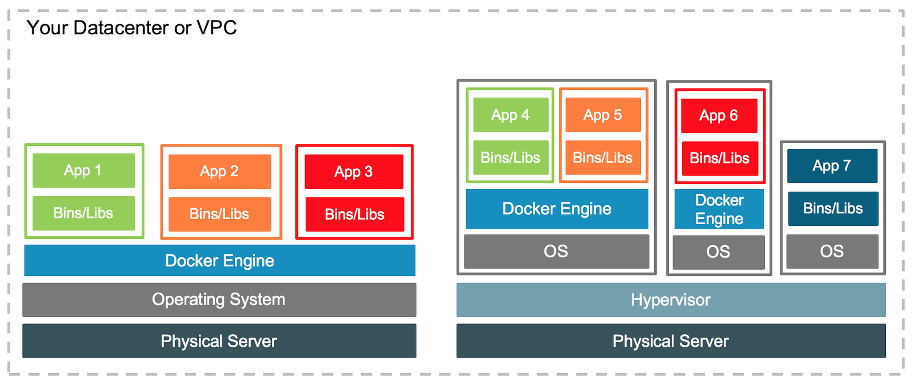
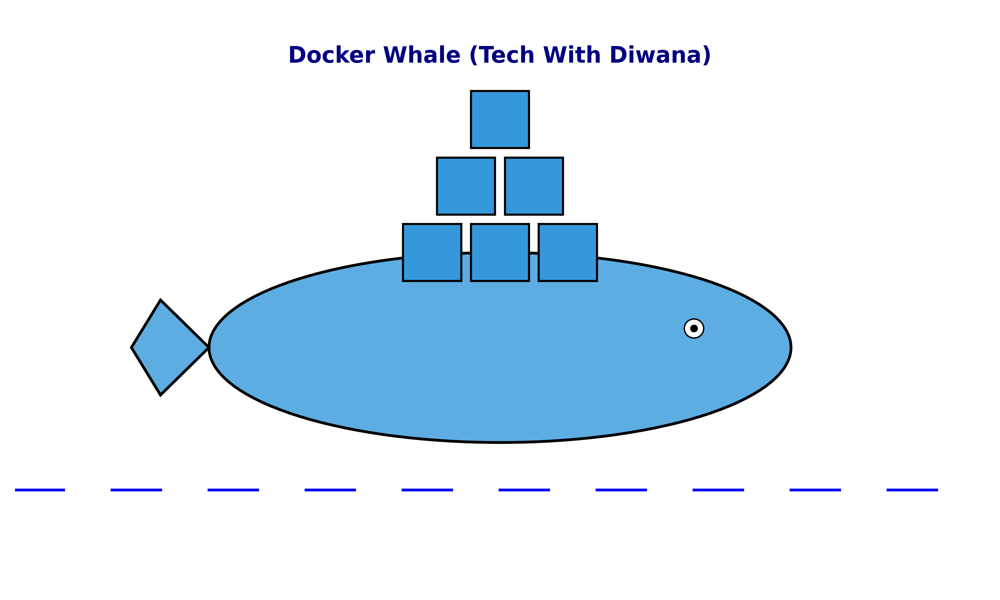
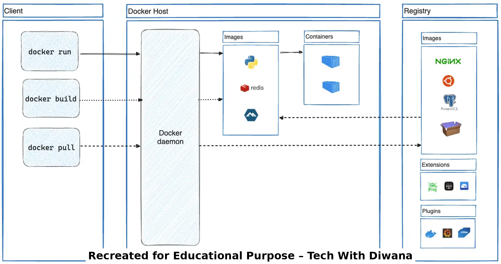

# 🚀 Docker Day-1: Introduction to Containers  

---

## 1. Introduction to Containers  

Containers ek **lightweight environment** hote hain jaha applications aur unki dependencies ek isolated environment me run hoti hain.  
Yeh developers ko ek consistent environment dete hain jo **development → testing → production** tak same tarike se kaam karta hai.  

---

## 🔹 Virtualization vs Containerization  

- **Virtualization (VMs):**
  - Virtual Machines run on a **Hypervisor**.
  - Har VM ka apna **Guest OS** hota hai.
  - Heavy → Zyada CPU/RAM lagta hai, aur startup slow hota hai.  

- **Containerization:**
  - Containers **Host OS Kernel** ko share karte hain.
  - Lightweight → Fast startup, kam resource usage.
  - Ek server par multiple containers easily run karte hain.  

📸 Diagram:  

  

---

## 🔹 Docker kya hai aur kyu use karte hain?  

- Docker ek **Containerization Platform** hai.  
- Ek baar app ko Docker image me package karo → kahin bhi run karo (consistency).  
- Developers ke liye **dependency conflicts solve** karta hai.  
- **Microservices aur CI/CD pipelines** me sabse zyada use hota hai.  

📸 Diagram:  

  

---

## 🔹 Container Architecture vs VM Architecture  

- **VM Architecture:**  
  Physical Server → Hypervisor → Guest OS → Applications  

- **Container Architecture:**  
  Physical Server → Host OS → Docker Engine → Containers  

📸 Diagram:  

  

---

## 🔹 Docker Engine & Daemon  

- **Docker Client (CLI):**
  - Jaha hum commands run karte hain → `docker build`, `docker run`, `docker pull`.  
- **Docker Daemon (`dockerd`):**
  - Background service jo containers ko create, run aur manage karta hai.  
- **Images:**
  - Templates (read-only) jo containers banane ke liye use hote hain.  
- **Containers:**
  - Running instances of Docker images.  
- **Registry (Docker Hub):**
  - Public/private store jaha se images **pull** aur **push** karte hain.  

📸 Diagram:  

  

---

## 🌐 Connect with Me  

- 🎥 **YouTube:** [Tech With Diwana](https://www.youtube.com/@TechWithDiwana)  
- 💻 **GitHub:** [techwithdiwana](https://github.com/techwithdiwana/)  
- 💼 **LinkedIn:** [Tech With Diwana](https://linkedin.com/in/techwithdiwana)  

---

✍️ Prepared By: **Tech With Diwana**
