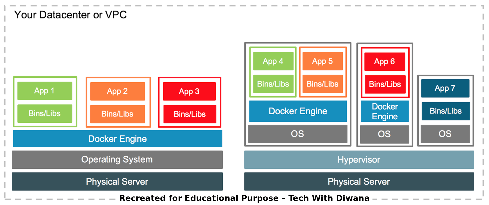

# 🚀 Docker Day-1: Introduction to Containers  

 
 
 

---

## 1. Virtualization vs Containerization  
- **Virtualization (VMs):**
  - Har VM ka apna **Guest OS** hota hai.
  - Zyada heavy, CPU/RAM consume karta hai.  
- **Containerization:**
  - Containers **Host OS kernel share** karte hain.
  - Lightweight aur fast hote hain.  

📸 Diagrams:  

  
  

---

## 2. Docker kya hai aur kyu use karte hain?  
- Docker ek **containerization platform** hai jo apps ko build, ship aur run karne me madad karta hai.  
- Ek baar image banao → kahin bhi chalao.  
- Microservices aur CI/CD pipelines me sabse useful.  

📸 Diagram:  

  

---

## 3. Container Architecture vs VM Architecture  
- **VM Architecture:** Hardware → Hypervisor → Guest OS → Apps  
- **Container Architecture:** Hardware → Host OS → Docker Engine → Containers  

📸 Diagrams:  

  
  

---

## 4. Docker Engine & Daemon  
- **Docker Client (CLI)** → Commands run karta hai.  
- **Docker Daemon (`dockerd`)** → Containers manage karta hai.  
- **Registry (Docker Hub)** → Images store & share karte hain.  

📸 Diagram:  

  

---

✍️ Prepared By: **Tech With Diwana**
