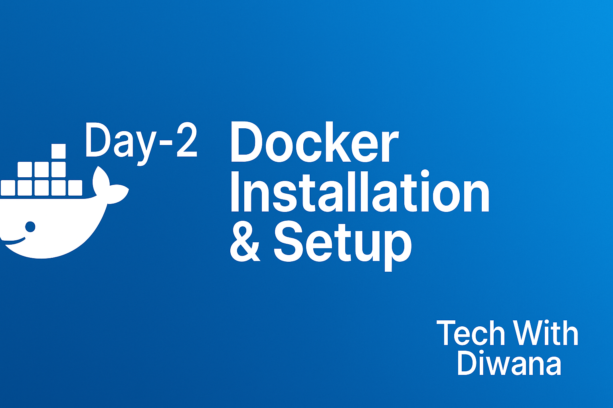

# 🚀 Day 2: Docker Installation & Setup  



[](https://www.docker.com/)  
[](https://learn.microsoft.com/en-us/windows/wsl/install)  
[](https://ubuntu.com/)  
[](https://www.docker.com/products/docker-desktop/)  

📺 [Watch on YouTube – Tech With Diwana](https://www.youtube.com/@TechWithDiwana) | 💼 [Connect on LinkedIn](https://linkedin.com/in/techwithdiwana)  

---

## 📌 Topics Covered
- Windows, Linux, Mac par Docker installation  
- Docker Desktop vs Docker Engine  
- Windows me WSL2 ke sath Docker setup  
- EC2 Ubuntu pe Docker setup  
- docker.io vs docker-ce ka difference  
- Docker basic commands  

---

## 🐳 1. Docker Desktop vs Docker Engine
- **Docker Engine** → Linux par natively run hota hai (daemon + CLI).  
- **Docker Desktop** → Windows/macOS ke liye GUI app hai jo Engine ko WSL2/VM me run karta hai.  
- 👉 Linux users ke liye **Engine**, Windows/macOS users ke liye **Docker Desktop** best hai.  

---

## 🪟 2. Windows Setup (Docker Desktop + WSL2)

1. **Enable WSL2**
   ```powershell
   wsl --install
   wsl --set-default-version 2
   ```
   Restart system after enabling.

2. **Install Ubuntu**  
   - Microsoft Store → Ubuntu 22.04 LTS  
   - Launch and set username/password  

3. **Install Docker Desktop**  
   - Download 👉 [Docker Desktop for Windows](https://www.docker.com/products/docker-desktop/)  
   - During installation, select **“Use WSL 2 instead of Hyper-V”**  

4. **Enable WSL Integration**  
   - Docker Desktop → **Settings → Resources → WSL Integration**  
   - Enable integration for Ubuntu  

5. **Verify**  
   ```bash
   docker --version
   docker run hello-world
   ```

---

## 🐧 3. Linux (Ubuntu/Debian – APT)
```bash
# Remove old versions
sudo apt remove -y docker docker-engine docker.io containerd runc

# Install prerequisites
sudo apt update
sudo apt install -y ca-certificates curl gnupg lsb-release

# Add Docker GPG key & repo
curl -fsSL https://download.docker.com/linux/ubuntu/gpg |   sudo gpg --dearmor -o /usr/share/keyrings/docker-archive-keyring.gpg

echo   "deb [arch=$(dpkg --print-architecture) signed-by=/usr/share/keyrings/docker-archive-keyring.gpg]   https://download.docker.com/linux/ubuntu   $(lsb_release -cs) stable" |   sudo tee /etc/apt/sources.list.d/docker.list > /dev/null

# Install Docker Engine
sudo apt update
sudo apt install -y docker-ce docker-ce-cli containerd.io

# Add user to Docker group
sudo usermod -aG docker $USER
newgrp docker

# Verify
docker --version
docker run hello-world
```

---

## 📀 4. Linux (CentOS / RHEL / Fedora – RPM)
```bash
# Remove old versions
sudo yum remove docker docker-client docker-client-latest docker-common docker-latest   docker-latest-logrotate docker-logrotate docker-engine

# Install repo
sudo yum install -y yum-utils
sudo yum-config-manager --add-repo https://download.docker.com/linux/centos/docker-ce.repo

# Install Docker
sudo yum install -y docker-ce docker-ce-cli containerd.io

# Start service
sudo systemctl start docker
sudo systemctl enable docker

# Verify
docker --version
docker run hello-world
```

---

## 🍏 5. macOS
- **Option 1 (Recommended):** [Docker Desktop for Mac](https://www.docker.com/products/docker-desktop/)  
- **Option 2 (Lightweight Alternative):**
  ```bash
  brew install docker colima
  colima start
  docker run hello-world
  ```

---

## ☁️ 6. AWS EC2 (Ubuntu)
```bash
ssh -i key.pem ubuntu@<EC2-Public-IP>

# Follow Ubuntu installation steps

# Test with nginx
docker run -d --name mynginx -p 80:80 nginx:alpine
```
Open in browser: `http://<EC2-Public-IP>`

---

## ⚡ 7. docker.io vs docker-ce
| Package       | Source              | Version | Use Case            |
|---------------|---------------------|---------|---------------------|
| `docker.io`   | Ubuntu default repo | Older   | Quick tests, labs   |
| `docker-ce`   | Docker official repo| Latest  | Production, secure  |

👉 Recommended: **docker-ce**

---

## 🛠️ 8. Basic Docker Commands
```bash
docker --version        # Check version
docker run hello-world  # Test
docker ps               # Running containers
docker ps -a            # All containers
docker images           # List images
docker run -it alpine sh # Run interactive container
docker run -d -p 8080:80 nginx:alpine # Run nginx server
docker rm <id>          # Remove container
docker rmi <id>         # Remove image
docker compose version  # Check Compose
```

---

## ✅ Summary
- Windows/Mac → Install Docker Desktop (Windows requires WSL2 integration).  
- Linux → Install Docker Engine (`docker-ce` recommended).  
- EC2 → Same as Ubuntu steps.  
- Verify → `docker run hello-world`.  
- Practice → `docker ps`, `docker images`, `docker run nginx`.  

---

📺 [Watch on YouTube – Tech With Diwana](https://www.youtube.com/@TechWithDiwana) | 💼 [Connect on LinkedIn](https://linkedin.com/in/techwithdiwana)  
