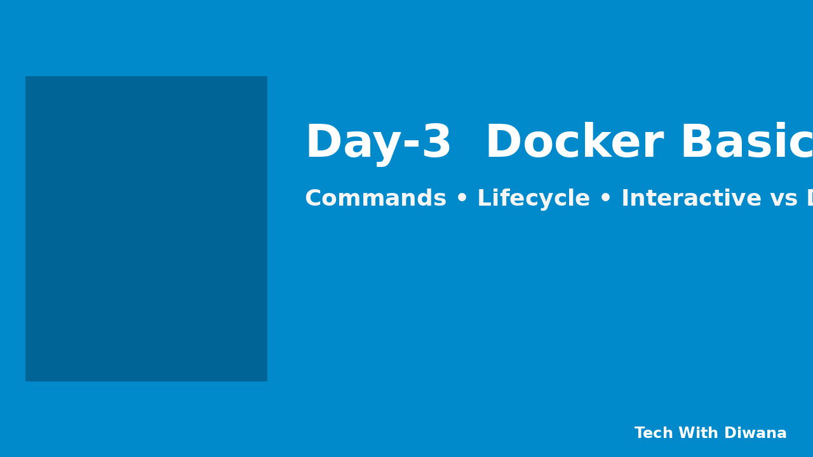

# Day 3 — Docker Basics



[](https://docs.docker.com/) 
[](#core-commands) 
[](#core-commands) 
[](#container-lifecycle) 
[](#interactive-vs-detached) 
[](#logs-and-exec) 
[](#hands-on-lab) 
[](LICENSE)

---

## About this guide
Day-3 covers essential Docker basics: core commands, container lifecycle, interactive vs detached mode, and logs/exec.  
All topics include step-by-step hands-on labs for easy learning.

## Table of Contents

1. [Prerequisites](#prerequisites)
2. [Quick cheat sheet](#quick-cheat-sheet)
3. [Image vs Container (short & clear)](#image-vs-container)
4. [Core commands: `docker run`, `docker ps`, `docker stop`, `docker rm`](#core-commands)
5. [Container lifecycle (create, start, stop, restart, pause, remove)](#container-lifecycle)
6. [Interactive vs Detached mode (`-it` vs `-d`)](#interactive-vs-detached)
7. [Logs & Exec: `docker logs` and `docker exec` (hands-on)](#logs-and-exec)
8. [Step-by-step hands-on lab (practice exercises)](#hands-on-lab)
9. [Troubleshooting & tips](#troubleshooting--tips)
10. [Cheat sheet / Quick commands table](#cheat-sheet--quick-commands)
11. [Further reading & clickable links](#further-reading--clickable-links)

---

## Prerequisites

- Docker installed on your machine (Docker Desktop for Windows/Mac or Docker Engine on Linux).
- Basic terminal / PowerShell knowledge.

Verify:

```bash
docker --version
docker info   # (may require sudo on Linux)
```

If it prints version and info, you're ready.

---

## Quick cheat sheet

- `docker run` — create and start a container from image
- `docker ps` — list running containers
- `docker ps -a` — list all containers (running + stopped)
- `docker stop` — stop a running container
- `docker rm` — remove a stopped container
- `docker images` — list local images
- `docker rmi` — remove image
- `docker logs` — view container logs
- `docker exec` — run a command inside a running container

---

## Image vs Container

**Image**: a read-only template (binary artifact) — like an application snapshot (think: a `.zip` of runnable filesystem + metadata).

**Container**: a running (or stopped) instance of an image — like a launched virtual process with its own filesystem, network, and process tree.

Analogy: **Image = class**, **Container = object / instance**.

Inspect images and containers:

```bash
docker images       # show local images
docker ps -a        # show containers (running + stopped)
```

---

## Core commands

### `docker run`
Create and run a container from an image.

Examples & explanation:

```bash
# Run nginx detached, name it, map host port 8080 to container 80
docker run --name my-nginx -d -p 8080:80 nginx
```

Flags explained:
- `--name my-nginx` — give container a friendly name
- `-d` — detached mode (run in background)
- `-p 8080:80` — map host:container port (hostPort:containerPort)

Other useful forms:

```bash
# Interactive Ubuntu shell
docker run -it --rm ubuntu bash

# Run a one-off command and auto-remove when done
docker run --rm alpine echo "hello from alpine"
```

`--rm` removes the container automatically after it exits (good for ephemeral runs).

---

### `docker ps`

```bash
docker ps           # running containers
docker ps -a        # all containers including stopped ones
```

Important columns: `CONTAINER ID`, `IMAGE`, `COMMAND`, `CREATED`, `STATUS`, `PORTS`, `NAMES`.

---

### `docker stop`, `docker rm`

Stop then remove a container:

```bash
docker stop my-nginx
docker rm my-nginx
```

Force-remove (stop + remove) quickly:

```bash
docker rm -f <container-id-or-name>
```

Remove multiple stopped containers:

```bash
docker container prune   # interactive confirmation
# or remove all stopped containers without confirmation (use with care)
docker rm $(docker ps -a -q)
```

Be cautious: `docker rm -f` and `docker rmi -f` can delete running stuff.

---

## Container lifecycle

1. **Create** — create container metadata but don't start it
   ```bash
   docker create --name my_ctr nginx
   ```
2. **Start** — start a stopped container
   ```bash
   docker start my_ctr
   ```
3. **Stop** — stop running container gracefully
   ```bash
   docker stop my_ctr
   ```
4. **Restart** — stop & start
   ```bash
   docker restart my_ctr
   ```
5. **Pause / Unpause** — freeze processes (useful for debugging)
   ```bash
   docker pause my_ctr
   docker unpause my_ctr
   ```
6. **Remove** — delete container metadata (container must be stopped first unless forced)
   ```bash
   docker rm my_ctr
   ```

Extra: `docker update` to change resource limits, `docker inspect` to view low-level details.

---

## Interactive vs Detached mode

**Interactive (`-it`)**:
- Use when you want a shell or interactive program inside the container.
- Example:

```bash
docker run -it ubuntu bash
# inside container: ls, apt-get, cd etc.
```

**Detached (`-d`)**:
- Use when you want the container to run in background (services like databases, web servers).
- Example:

```bash
docker run -d --name redis-server redis
```

Combine flags: `-it` is for terminal sessions; `-d` runs in background. You usually use one or the other depending on purpose.

Note: If you start a container in detached mode but still want a shell later, use `docker exec -it <name> /bin/bash`.

---

## Logs and Exec — `docker logs` & `docker exec` (hands-on)

### `docker logs`

View logs of a container (stdout/stderr captured by Docker):

```bash
# show all logs
docker logs my-nginx

# follow logs (like tail -f)
docker logs -f my-nginx

# last N lines
docker logs --tail 50 my-nginx
```

**Use case**: check why an app failed to start, inspect output of processes.

### `docker exec`

Run a command inside a running container:

```bash
# Start an interactive shell inside a container
docker exec -it my-nginx /bin/bash      # if bash exists
# or for lightweight images
docker exec -it alpine-container /bin/sh

# Run a one-off command inside container
docker exec my-nginx ls -la /usr/share/nginx/html
```

**Difference between `docker attach` and `docker exec`:**
- `attach` connects to the main process's stdio (can be messy),
- `exec` spawns a new process inside the container (safer for admin tasks).

---

## Hands-on lab (step-by-step)

### Exercise 1 — Run nginx and view page

```bash
# 1. Run nginx
docker run --name my-nginx -d -p 8080:80 nginx

# 2. Check running container
docker ps

# 3. Open your browser:
#    http://localhost:8080
```

Expected: Nginx welcome page.

Then inspect logs:

```bash
docker logs -f my-nginx
```

Stop & remove:

```bash
docker stop my-nginx
docker rm my-nginx
```

---

### Exercise 2 — Practice with stopped containers and removal

1. Create a container but don’t start it yet:
```bash
docker create --name tempctr alpine sleep 60
```
2. Start it:
```bash
docker start tempctr
```
3. Check status:
```bash
docker ps -a
```
4. Stop and remove:
```bash
docker stop tempctr
docker rm tempctr
```

---

### Exercise 3 — Interactive debugging with `exec`

1. Run a container from Ubuntu interactively:

```bash
docker run -it --name dbg ubuntu bash
# inside: apt update, install tools, explore
```

2. Start a container detached and later exec into it:

```bash
docker run -d --name myapp alpine sleep 1000
docker exec -it myapp /bin/sh
```

---

## Troubleshooting & tips

- **Port already in use**: change host port `-p 8081:80` or stop the conflicting app.
- **Permission denied on Linux**: use `sudo docker ...` or add your user to `docker` group (log out/in required).
- **Image not found**: `docker pull <image>` or check image name and tag.
- **`/bin/bash` not found**: use `/bin/sh` for smaller images (alpine).
- **Cleanup**:
  - Remove dangling images: `docker image prune`
  - Remove all unused images: `docker image prune -a`
  - Remove all stopped containers: `docker container prune`

---

## Cheat sheet / Quick commands

| Goal | Command |
|---|---|
| List running containers | `docker ps` |
| List all containers | `docker ps -a` |
| Run detached | `docker run -d --name myctr -p 80:80 nginx` |
| Run interactive shell | `docker run -it ubuntu bash` |
| Stop container | `docker stop <name>` |
| Remove container | `docker rm <name>` |
| View logs | `docker logs -f <name>` |
| Exec into container | `docker exec -it <name> /bin/bash` |
| List images | `docker images` |
| Remove image | `docker rmi <image>` |
| Prune unused | `docker system prune` (careful) |

---

## Further reading & clickable links

- Official Docker docs: https://docs.docker.com/  
- `docker run` reference: https://docs.docker.com/engine/reference/commandline/run/
- Docker cheat sheet: https://github.com/wsargent/docker-cheat-sheet (useful quick ref)
- Previous day (Day-2) materials (clickable): [Day-2 repo — docker-zero-to-hero](https://github.com/techwithdiwana/docker-zero-to-hero/tree/main/day-2)

---

## License

MIT — use, remix and teach freely.

---

### Notes for recording / teaching

- Demonstrate `docker run` first (detached nginx) then `docker run -it` to show interactive mode.
- Use `docker logs -f` to show live logs while you perform actions.
- Keep one slide / clip per command so learners can pause and try.
