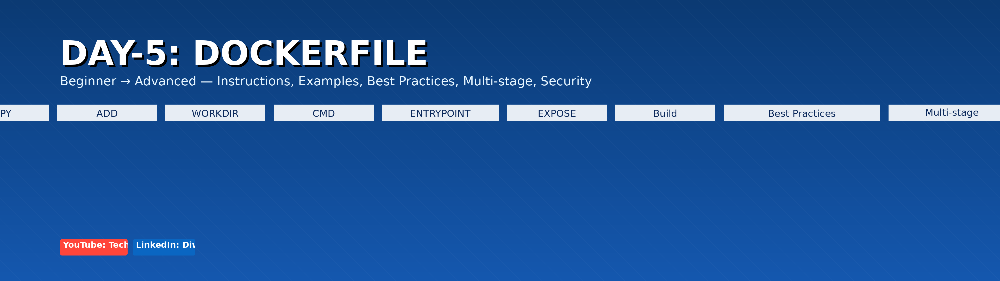

# 📘 Day-5: Dockerfile (Beginner → Advanced)



**Complete guide:** All Dockerfile instructions (17), What / Why / How examples, application architectures, Dockerfile examples (Node.js, Python FastAPI, Java Spring Boot, React), best practices, multi-stage builds, .dockerignore, and security checklist — ready for GitHub repo use.

---

## 🔹 Quick Navigation
- [Pre-Dockerfile Checklist](#pre-dockerfile-architecture-checklist)
- [Repo Layout](#recommended-repo-layouts)
- [All 17 Dockerfile Instructions (What / Why / How)](#all-17-dockerfile-instructions--what--why--how)
- [Application Architectures + Dockerfiles](#application-architectures--dockerfiles)
- [Build, Tag, Run, Push](#build-tag-run-push)
- [.dockerignore Usage](#dockerignore-usage)
- [Best Practices](#best-practices)
- [Security Checklist](#security-checklist)
- [CI/CD Tips & Scanning](#cicd-tips--image-scanning)
- [Quick Reference Table](#quick-reference-table)
- [Appendix: Sample Scaffolds Included](#appendix-sample-scaffolds-included)

---

## Pre-Dockerfile Architecture Checklist

Before writing a Dockerfile for any project, confirm the following:
- **Application type & runtime:** Node.js, Python, Java, or static frontend. Pick base image family accordingly.
- **Build vs runtime steps:** Determine compilation, bundling, and which artifacts are required in final image.
- **Folder structure:** Decide what to copy into the image and the working directory.
- **.dockerignore:** Exclude node_modules, build artifacts, .git, .env, IDE configs to reduce context and secrets leaks.
- **Ports & health endpoints:** Choose port(s) and add a `/health` endpoint if possible for `HEALTHCHECK`.
- **Secrets & config:** Do NOT store secrets in images. Use environment variables, Docker secrets, or orchestration secret store.
- **User & permissions:** Plan to run as non-root where possible and ensure proper file ownership/perms.
- **Multi-stage builds:** Use them for compiled languages or frontend builds to reduce final image size.

---

## Recommended Repo Layouts

**Single-app repository**
```
my-app/
├─ README.md
├─ .gitignore
├─ .dockerignore
├─ Dockerfile or docker/Dockerfile
├─ src/ or app/
├─ package.json / requirements.txt / pom.xml
└─ build/ or dist/ (gitignored)
```

**Monorepo or multi-service**
```
repo-root/
├─ services/
│  ├─ service-a/
│  │  ├─ Dockerfile
│  │  └─ src/
│  └─ service-b/
└─ docs/
```

Place Dockerfiles near the code they build. Use `docker/` directory only for multiple targets or when you want separate prod/dev Dockerfiles.

---

## All 17 Dockerfile Instructions — What / Why / How (with short examples)

The 17 instructions are: `FROM`, `LABEL`, `RUN`, `CMD`, `ENTRYPOINT`, `EXPOSE`, `ENV`, `ARG`, `COPY`, `ADD`, `WORKDIR`, `VOLUME`, `USER`, `HEALTHCHECK`, `ONBUILD`, `SHELL`, `STOPSIGNAL`.

### 1) FROM
- **What:** Selects base image. Required unless using `FROM scratch` intentionally.
- **Why:** Provides OS/runtime and preinstalled packages.
- **How:** `FROM node:18-alpine` or `FROM python:3.11-slim`

### 2) LABEL
- **What:** Adds metadata to the image (key/value).
- **Why:** Useful for maintainers, automation, and scanning systems.
- **How:** `LABEL maintainer="You <you@example.com>" version="1.0"`

### 3) RUN
- **What:** Execute a command at build time, producing new layers.
- **Why:** Install dependencies, compile code, perform setup.
- **How:** Combine commands to reduce layers:
```dockerfile
RUN apt-get update && apt-get install -y curl && rm -rf /var/lib/apt/lists/*
RUN npm ci --only=production
```

### 4) CMD
- **What:** Default command to run when container starts (overridable).
- **Why:** Define your container’s runtime process.
- **How:** Use exec form for correct signal behavior:
```dockerfile
CMD ["node","src/index.js"]
```

### 5) ENTRYPOINT
- **What:** Sets a fixed executable to run; CMD provides default args.
- **Why:** Useful for making container behave like a CLI tool.
- **How:**
```dockerfile
ENTRYPOINT ["python","app.py"]
CMD ["--help"]
```

### 6) EXPOSE
- **What:** Documents the port(s) app listens on (metadata only).
- **Why:** Helpful for humans and orchestration; does not publish port.
- **How:** `EXPOSE 3000`

### 7) ENV
- **What:** Sets environment variables in the image.
- **Why:** Provide defaults and configuration visible at runtime.
- **How:** `ENV NODE_ENV=production`

### 8) ARG
- **What:** Build-time variables available only during build.
- **Why:** Parameterize builds (e.g., version selection).
- **How:**
```dockerfile
ARG NODE_VERSION=18
FROM node:${NODE_VERSION}-alpine
```

### 9) COPY
- **What:** Copies files/folders from build context to image.
- **Why:** Bring source code, configs, and assets into the image.
- **How:** `COPY package*.json /app/`

### 10) ADD
- **What:** Like COPY but also extracts local tar archives and supports URLs.
- **Why:** Use for auto-extracting tarballs or fetching remote resources at build time.
- **How:** `ADD archive.tar.gz /app/` — Prefer COPY unless you need ADD features.

### 11) WORKDIR
- **What:** Sets working directory for subsequent instructions.
- **Why:** Avoids repeated `cd` and makes files relative to a known dir.
- **How:** `WORKDIR /app`

### 12) VOLUME
- **What:** Declares a mount point for external volumes.
- **Why:** Persist runtime data outside image (databases, uploads).
- **How:** `VOLUME /data`

### 13) USER
- **What:** Sets user (and optional group) for subsequent commands and runtime.
- **Why:** Run as non-root for better security.
- **How:**
```dockerfile
RUN addgroup -S appgroup && adduser -S appuser -G appgroup
USER appuser
```

### 14) HEALTHCHECK
- **What:** Defines a command Docker runs to determine container health.
- **Why:** Allows orchestrators to detect unhealthy containers and act.
- **How:**
```dockerfile
HEALTHCHECK --interval=30s --timeout=5s --start-period=10s CMD curl -f http://localhost:3000/health || exit 1
```

### 15) ONBUILD
- **What:** Adds instructions that execute when image is used as a base by another build.
- **Why:** Useful for base images that should enforce specific steps for downstream images.
- **How:**
```dockerfile
ONBUILD COPY . /app
ONBUILD RUN npm install
```

### 16) SHELL
- **What:** Override default shell used by RUN (`/bin/sh -c`).
- **Why:** Use bash features or Windows PowerShell where needed.
- **How:** `SHELL ["bash","-c"]`

### 17) STOPSIGNAL
- **What:** Sets the signal sent to container for graceful shutdown.
- **Why:** Useful for apps that trap signals to perform cleanup.
- **How:** `STOPSIGNAL SIGTERM`

---

## Application Architectures + Dockerfile Examples (Full)

### Node.js (Express) — Architecture
```
node-app/
├─ Dockerfile
├─ package.json
├─ package-lock.json
├─ src/
│  └─ index.js
└─ .dockerignore
```

**Dockerfile (production-ready, non-root)**
```dockerfile
FROM node:18-alpine
LABEL maintainer="you@example.com"
WORKDIR /app

COPY package*.json ./
RUN npm ci --only=production

COPY . .

ENV NODE_ENV=production
EXPOSE 3000
USER node
HEALTHCHECK --interval=30s --timeout=5s CMD wget -qO- http://localhost:3000/health || exit 1
CMD ["node","src/index.js"]
```

---

### Python (FastAPI) — Architecture
```
fastapi-app/
├─ Dockerfile
├─ requirements.txt
├─ app/
│  └─ main.py
└─ .dockerignore
```

**Dockerfile (production)**
```dockerfile
FROM python:3.11-slim
LABEL maintainer="you@example.com"
WORKDIR /app

COPY requirements.txt ./
RUN pip install --no-cache-dir -r requirements.txt

COPY . .

ENV PORT=8000
EXPOSE 8000
USER 1001
HEALTHCHECK --interval=30s --timeout=5s CMD wget -qO- http://localhost:8000/health || exit 1
CMD ["uvicorn","app.main:app","--host","0.0.0.0","--port","8000"]
```

---

### Java (Spring Boot) — Architecture
```
springboot-app/
├─ Dockerfile
├─ target/
│  └─ myapp.jar
└─ .dockerignore
```

**Dockerfile (simple production)**
```dockerfile
FROM openjdk:17-jdk-slim
LABEL maintainer="you@example.com"
WORKDIR /app
COPY target/myapp.jar app.jar
EXPOSE 8080
STOPSIGNAL SIGTERM
HEALTHCHECK --interval=30s --timeout=5s CMD wget -qO- http://localhost:8080/actuator/health || exit 1
CMD ["java","-jar","app.jar"]
```

---

### React (Frontend) — Architecture
```
react-app/
├─ Dockerfile
├─ package.json
├─ src/
└─ public/
```

**Dockerfile (multi-stage)**
```dockerfile
# Build stage
FROM node:18-alpine AS builder
WORKDIR /app
COPY package*.json ./
RUN npm ci
COPY . .
RUN npm run build

# Runtime stage
FROM nginx:alpine
LABEL maintainer="you@example.com"
COPY --from=builder /app/build /usr/share/nginx/html
EXPOSE 80
HEALTHCHECK --interval=30s --timeout=5s CMD wget -qO- http://localhost/ || exit 1
CMD ["nginx","-g","daemon off;"]
```

---

## Build, Tag, Run, Push (Examples)

```bash
# Build image in current directory
docker build -t myorg/myapp:1.0 .

# Build specifying Dockerfile path
docker build -f docker/Dockerfile -t myorg/myapp:1.0 .

# Run container (map ports)
docker run -d -p 8080:3000 --name myapp --restart unless-stopped myorg/myapp:1.0

# Tag and push
docker tag myorg/myapp:1.0 registry.example.com/myorg/myapp:1.0
docker push registry.example.com/myorg/myapp:1.0
```

---

## .dockerignore Usage

Recommended `.dockerignore` contents:
```
node_modules
dist
build
.git
.env
Dockerfile*
*.log
.vscode
.idea
```

Tips:
- Keep build context small and avoid copying secrets.
- Use `.dockerignore` to prevent unnecessary files from being sent to Docker daemon.

---

## Best Practices

- Pin base image versions (avoid `latest`). Example: `node:18.20.0-alpine`.
- Combine `RUN` steps to reduce layers and improve cache usage.
- Copy dependency manifests first, install deps, then copy source to leverage layer caching.
- Prefer `COPY` over `ADD` unless extraction or URL fetch is required.
- Use multi-stage builds for compiled code and frontend builds.
- Run processes as non-root users and limit file permissions.
- Strip dev dependencies in final image (use `npm ci --only=production` or similar).
- Add `HEALTHCHECK`, `LABEL`, and `STOPSIGNAL` where appropriate.
- Scan images with Trivy/Clair as part of CI.

---

## Security Checklist

- Never bake secrets into images. Use environment variables or orchestration secrets.
- Use minimal runtime images (alpine, slim, distroless) for production.
- Remove package manager caches after install (`apt-get clean`, `pip --no-cache-dir`).
- Use non-root users and limit capabilities in runtime.
- Automate image scanning and rebuild images when base image CVEs are fixed.
- Restrict container filesystem (read-only rootfs) where appropriate.
- Limit network access and use network policies in orchestration.

---

## CI/CD Tips & Image Scanning

- Use reproducible tags (commit SHA + semver) for CI-built images.
- Scan images in CI (Trivy) before pushing to production registries.
- Use `docker buildx` for multi-arch builds if supporting multiple architectures.
- Automate image rebuilds when upstream base images are updated or patched.

---

## Quick Reference Table

| Instruction | Purpose | Example |
|-------------|---------|---------|
| FROM | Base image | `FROM node:18-alpine` |
| LABEL | Metadata | `LABEL maintainer=\"you@example.com\"` |
| RUN | Build command | `RUN npm ci --only=production` |
| CMD | Default runtime cmd | `CMD [\"node\",\"index.js\"]` |
| ENTRYPOINT | Fixed executable | `ENTRYPOINT [\"python\",\"app.py\"]` |
| EXPOSE | Port metadata | `EXPOSE 3000` |
| ENV | Env vars | `ENV NODE_ENV=production` |
| ARG | Build-time var | `ARG NODE_VERSION=18` |
| COPY | Copy files | `COPY package*.json /app/` |
| ADD | Copy + extract | `ADD archive.tar.gz /app/` |
| WORKDIR | Set working dir | `WORKDIR /app` |
| VOLUME | Mount point | `VOLUME /data` |
| USER | Set user | `USER appuser` |
| HEALTHCHECK | Health probe | `HEALTHCHECK CMD curl -f ...` |
| ONBUILD | Child build triggers | `ONBUILD RUN npm install` |
| SHELL | Change shell | `SHELL [\"bash\",\"-c\"]` |
| STOPSIGNAL | Stop signal | `STOPSIGNAL SIGTERM` |

---

## Appendix: Sample Scaffolds Included in this package
- `node-app/` — Express minimal app + Dockerfile
- `fastapi-app/` — FastAPI minimal app + Dockerfile
- `react-app/` — React scaffold Dockerfile (multi-stage)
- `springboot-app/` — Dockerfile + placeholder info (place built JAR under `target/`)

---

## How to commit to your repo

1. Unzip this package and copy contents into `day-5/` folder of your repo.
2. Run:
```bash
git add day-5/*
git commit -m "Add Day-5: Dockerfile full README, banners and sample scaffolds"
git push origin main
```

---

If you want, I can now:
- Generate SVG architecture diagrams and add them to README.
- Create separate markdown pages per section for modular docs.
- Prepare a Git patch (diff) to apply directly to your repo.


