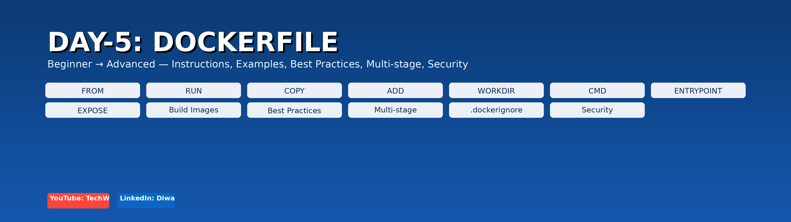

# 📘 Day-5: Dockerfile (Beginner → Advanced)



[](https://www.youtube.com/@techwithdiwana) [](https://www.linkedin.com/in/diwana-kumar-418592128/)

---

## 🔹 Topics Covered

       

    

---

## 1) Pre-Dockerfile Architecture Checklist

- Confirm application type and runtime (Node.js, Python, Java, React static).
- Separate build steps and runtime steps.
- Define folder structure and files required at runtime.
- Add entries to `.dockerignore` to exclude node_modules, .git, .env, etc.
- Identify ports and healthcheck endpoints.
- Use environment variables or secret manager (do not bake secrets).
- Plan for non-root runtime user and file permissions.
- Decide on multi-stage builds for compiled projects.

---

## 2) Recommended Repo Layout

```
my-app/
├─ README.md
├─ .gitignore
├─ .dockerignore
├─ docker/
│  └─ Dockerfile
├─ src/ or app/
├─ package.json or requirements.txt or pom.xml
├─ build/ or dist/ (gitignored)
└─ scripts/
```

---

## 3) All 17 Dockerfile Instructions — What / Why / How (with examples)

> See `docs/` or sections below for full explanations. Quick summary:

1. FROM — base image. `FROM node:18-alpine`  
2. LABEL — metadata. `LABEL maintainer="you@example.com"`  
3. RUN — build-time commands. `RUN npm ci --only=production`  
4. CMD — default runtime command. `CMD ["node","index.js"]`  
5. ENTRYPOINT — fixed executable. `ENTRYPOINT ["python","app.py"]`  
6. EXPOSE — port metadata. `EXPOSE 3000`  
7. ENV — env vars. `ENV NODE_ENV=production`  
8. ARG — build-time variables. `ARG NODE_VERSION=18`  
9. COPY — copy files. `COPY package*.json /app/`  
10. ADD — copy+extract or URL. `ADD archive.tar.gz /app/`  
11. WORKDIR — set working directory. `WORKDIR /app`  
12. VOLUME — mount points. `VOLUME /data`  
13. USER — set runtime user. `USER appuser`  
14. HEALTHCHECK — container health probe. `HEALTHCHECK CMD curl -f http://...`  
15. ONBUILD — triggers for child builds. `ONBUILD COPY . /app`  
16. SHELL — change default shell. `SHELL ["bash","-c"]`  
17. STOPSIGNAL — graceful stop. `STOPSIGNAL SIGTERM`

> Full What/Why/How details are included in the `README_full.md` within this package.

---

## 4) Application Architectures + Dockerfile Examples

Included sample project scaffolds (Node.js, Python FastAPI, Java Spring Boot, React) with production-ready Dockerfiles:

- `node-app/` — Express app (Dockerfile, .dockerignore, sample src)
- `fastapi-app/` — FastAPI app (Dockerfile, requirements.txt, sample app)
- `springboot-app/` — Spring Boot layout (Dockerfile; assumes JAR in target/)
- `react-app/` — React multi-stage build (Dockerfile)

Each scaffold includes a README and Dockerfile optimized with multi-stage (where applicable), non-root user, HEALTHCHECK, and pinned base images.

---

## 5) Build, Tag, Run, Push (examples)

```bash
# Build
docker build -t myorg/myapp:1.0 -f docker/Dockerfile .

# Run
docker run -d -p 8080:3000 --name myapp --restart unless-stopped myorg/myapp:1.0

# Tag & push
docker tag myorg/myapp:1.0 yourregistry/myorg/myapp:1.0
docker push yourregistry/myorg/myapp:1.0
```

---

## 6) .dockerignore (recommended)

```
node_modules
dist
build
.git
.env
Dockerfile*
*.log
.vscode
.idea
```

---

## 7) Best Practices & Security Checklist

- Pin base image versions and rebuild frequently.
- Use multi-stage builds to keep final images small.
- Run as non-root user in production images.
- Do not include secrets or credentials in images.
- Clean package manager caches after installs.
- Scan images in CI (Trivy/Clair).
- Use HEALTHCHECK and LABELs.
- Use `.dockerignore` to reduce build context.

---

## Files included in this package

- day5_banner.png (high-res banner)
- day5_banner_thumb.png (thumbnail)
- README.md (this file)
- README_full.md (detailed guide with full What/Why/How for all 17 instructions)
- node-app/, fastapi-app/, springboot-app/, react-app/ (sample scaffolds)
- .dockerignore

---

Download the zip with everything (README, images, scaffolds, Dockerfiles):  
[Download Day-5 Dockerfile Package](sandbox:/mnt/data/dockerfile_day5.zip)

